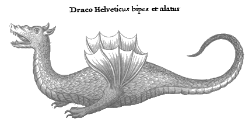

import HerosJourney from "./heros-journey.svg";

import AftermathRules from "../../src/rules/why-dragon/aftermath.mdx";
import BellowRules from "../../src/rules/why-dragon/bellow.mdx";
import FaceFuryRules from "../../src/rules/why-dragon/face-fury.mdx";
import JumpIntoFlamesRules from "../../src/rules/why-dragon/jump-into-flames.mdx";
import LevelUpRules from "../../src/rules/why-dragon/level-up.mdx";
import RelinquishYourGoalRules from "../../src/rules/why-dragon/relinquish-your-goal.mdx";
import StokeTheFireRules from "../../src/rules/why-dragon/stoke-the-fire.mdx";
import ThrowSandRules from "../../src/rules/why-dragon/throw-sand.mdx";
import TurnToAshRules from "../../src/rules/why-dragon/turn-to-ash.mdx";

tldr: I wrote a small game kinda by accident. get it [on itch.io]

[on itch.io]: https://hasparus.itch.io/

---

I signed up to run [1 HP Dragon] at a convention in a \<2 hour time window _with
hotseat_. Yeah... Pulling off something good in less than two hours, while your
players can join later or leave in the middle requires effort...

[1 HP dragon]: https://www.explorersdesign.com/the-1-hp-dragon

I need something **accessible**, **fast** and **small**.

I feel like you could play [1 HP Dragon] as a standalone ruleset, with no dice,
just with:

  <Line kind="arrow">If you can do it, do it.</Line>
  <Line kind="arrow">
    {"If you can't do it, plan better or do something else."}
  </Line>

<aside className="min-[1100px]:-translate-y-19">
  Clayton is turning 1 HP Dragon into a full game, but he's [calling
  it](https://www.explorersdesign.com/designing-lore-blocks/) "a game you can't
  play yet", and 1) I have a deadline, 2) I need something __accessible__, a
  basic dice game so everyone can pick it up in 5 seconds.
</aside>

Many players come to the hobby because they like the dice. They like how the
randomness and game mechanics help us tell stories more interesting than we'd be
able to tell without them.

So, some dice resolution will be more accessible than no dice. Principle of
Least Surprise, huh?

{/* prettier-ignore */}
I'm definitely taking a PbtA standard 2d6. Player-facing symmetric dice rolls
are fast: no turns, no action economy, DM doesn't roll. I know it sounds stupid,
but assume all dice rolls take constant time to roll, read the result and
narrate. This makes us more than <Tooltip text="I didn't measure anything. Sorry.">twice</Tooltip>
as fast as D&D!

<aside>DM = Dragon Minder, obviously</aside>

If it's PbtA, I'm gonna need some moves. I'm not taking Homebrew World or One
Shot World, both really good games that served me well on events, because I
won't have much time for character creation and building the world based on the
playbooks.

## Mechanics

We'll play with tiny playbooks. You make up your own Class: "Bard", "Wyvern
Lancer", whatever. It creates fictional positioning, affecting what you can and
cannot do, and once per session it lets you **Bellow**.

<Move illuminated isBaseMove>

### Bellow

<BellowRules components={props.components} />

</Move>

<aside>I considered naming it "Class Action".</aside>

Akin to Blades
[flashbacks](https://bladesinthedark.com/planning-engagement#flashbacks) or
spending a [Fate point](https://fate-srd.com/fate-core/fate-points) to declare a
story detail, this lets the Hunters fire a powerful "ultimate" to bite into the
Dragon's Armor, while we learn who they are and where they come from.

> A Bard: "I sang for the duke and then we partied way too much. The guy loves
> me. He'll help us for sure."

Instead of paying with a meta-currency, we get it once per game. Fits my 2-hour
constraint and leaves me room for meta-currencies I wanna explore later.

We know something about the Hunters' past, but not _why_ they face the Dragon.

### Goals

I wanna focus on the player characters' connection to their dragon. We call them
Hunters and each of them has a Goal: Vengeance, Power, Greed, Glory, Knowledge,
Oath.

A Goal can be relinquished, of course. Character development, hell yeah!

<Move illuminated isBaseMove>

### Relinquish Your Goal

<RelinquishYourGoalRules components={props.components} />

</Move>

But even before you get rid of it, the pursuit of it lets you affect the game.

<Move illuminated isBaseMove>

### Stoke the Fire

<StokeTheFireRules components={props.components} />

</Move>

<aside>repeatable if you dare!</aside>

### Pyre

The **Pyre** is your doom track. Think inverse health pool. Fill the fourth box
and you're **consumed**, dead or worse.

import fire from "../../src/fire.svg?url";

<Track
  name="Pyre"
  defaultValue={2}
  max={4}
  style={`--fire: url("${fire}")`}
  class="fire"
  marker="x"
/>

The game is about the Dragon, tactical storytelling and problem-solving, sure,
but also about the relation of our heroes to the Dragon and what they are
willing to sacrifice to defeat it.

**Consumed** doesn't mean "out of the game". If dying is boring, maybe you turn
against your friends as corrupted villains or undead servants of the dracolich.
The DM will feel responsible for time management, so we leave the exact timing
and nature of your fall to them.

This is usually an "opportunity for a cost" moment. Fáfnir was born a dwarf; his
greed turned him into a dragon.

That's goals, the _"Why"_ part of the title. We know something about the _"You"_
part: the Hunters, their Classes, though I don't think it's enough. How else do
they differ from each other? And how do they _"Fight"_?

We need some baseline dice resolution, stats and a catch-all move.

### Stats

I'm taking 3 stats, Body, Wits and Soul. The Dragon will attack them, dealing
damage like **-2 Body** or **-1 Soul**. From the perspective of the genre,
fighting a dragon is _exhausting_.

> Distribute values from -2 to +2 so that their total equals +1. Ignoring order:
> `(+2, 0, -1); (+1, +1, -1); (+1, 0, 0); (+2, +1, -2)`
>
> **Body:** Physical strength and stamina.\ **Wits:** Mental acuity and
> perception.\
> **Soul:** Arcane potency and spiritual force.
>
> 

I'm gonna base the catch-all on Jeremy Strandberg's [Defy Danger, Restated]. In
the small little village called ~~Stonetop~~ CC BY-SA 4.0, sharing is caring.

[Defy Danger, Restated]:
  https://spoutinglore.blogspot.com/2019/05/defy-danger-restated.html

<Move illuminated isBaseMove>

### Face Fury

<FaceFuryRules components={props.components} />

</Move>

<aside>
  <figure className="zaduma-line-art *:max-w-[414px]! [&_img]:object-left min-[1100px]:[&_img]:max-h-40 xl:[&_img]:max-h-60">
    
    <figcaption>
      A man on horseback stabbing a monster with a lance, from 'The King and His
      Three Sons', José Guadalupe Posada, 1852–1913
    </figcaption>
  </figure>
</aside>

### Teamwork?

**Face Fury** is the baseline: you against the obstacle, you against the Dragon.
Most often, it won't be just you. Others will jump in to help or, chasing their
own Goals, interfere with your actions.

<Move illuminated isBaseMove>

### Jump Into Flames

<JumpIntoFlamesRules components={props.components} />

</Move>

<aside>
  If **Jump Into Flames** or **Relinquish Your Goal** change a roll so it's no
  longer a miss, the miss XP and the DM move are cancelled. If it didn't play
  out as a miss in fiction, it was not a miss.
</aside>

<Move illuminated isBaseMove>

### Throw Sand

<ThrowSandRules components={props.components} />

</Move>

<figure className="my-12! draco-helveticus">

> Hard it is to defeat a dragon, but try one must.

<figcaption>
  from [New Athens](https://en.wikipedia.org/wiki/Nowe_Ateny), one of the first Polish encyclopedias; both quote and illustration, 1745
</figcaption>
</figure>

### The Ends

The moves so far trigger when the Hunters act. But what if the dice don't favor
them and the Dragon proves too strong?

<Move illuminated isBaseMove>

### Turn to Ash

<TurnToAshRules components={props.components} />

</Move>

<aside>
  Can you **Stoke the Fire** while your stat gets lowered to **-3** to raise
  Pyre anyway, but eke out a fail forward? Maybe. I leave it to the DM's
  discretion and player munchkin instincts.
</aside>

A downed Hunter goes back up when the smoke clears and the scene ends.

This would be a moment in the movie, when everybody thinks the character is
dead. The other Hunters may help, but it will take hours to get them back in
action.

**Turn to Ash** is the sacrifice you don't choose. Each time you fall in your
quest to slay the beast, you take one step towards the end, you're getting
closer to be **consumed**.

When your Pyre reaches 4 within **Turn to Ash**, it may mean death. Certainly
it's the easiest interpretation when you hit **-3 Body**. At **-3 Wits**,
madness. A&nbsp;Wizard at **-3 Soul** may be _hollowed_, mana-drained; whereas a
Peasant probably just gives up.

In contrast, when you're **consumed** by your own choice in **Stoke the Fire**,
it may be betrayal or corruption. Dying to a heart attack because you fought the
Dragon too hard isn't exactly in the genre, so sharpen the knives and watch your
back.

---

**Turn to Ash** and **Pyre** is how we go down, but we could use a little bit of
going up as a palate cleanser. We also need an XP sink. I love XP-on-Miss: it
incentivizes the players to play courageously and embrace setbacks. Let's see
what we can do with that hard-earned XP.

<Move illuminated isBaseMove>

### Level Up

<LevelUpRules components={props.components} />

</Move>

The Hunters can use XP to get stronger or postpone their doom. They can also
hoard it until the end of the game, until the **Aftermath**, to affect the world
and have more to say in the epilogue.

<HerosJourney
  role="img"
  aria-label="The Hero's Journey"
  className="mx-auto w-140 max-w-full"
/>

The Hero's Journey doesn't end when the Dragon is defeated. There's still
Transformation, Atonement and Return. Our session time is limited, so instead of
playing it out, please forgive me and brace for the longest procedure you've
ever read in a game.

<Move illuminated isBaseMove>

### Aftermath

<AftermathRules components={props.components} />

</Move>

Maybe, even with the Dragon defeated, the story isn't over? Maybe the Wyrmlings
have fled? Maybe someone has come to the battlefield after the Hunters left.

<aside>
  The DM should crumple all post-it notes with destroyed Legendary & [Permanent
  Armor][1 HP Dragon] of the Dragon by this moment, so it's easier for players
  to claim the remaining pieces.
</aside>

## DM Moves

I'm leaving the DM moves, agenda and principles as an exercise to the reader.
Tis but a write-up for people who already played a lot of games. I'm playing
this with a list yoinked from Stonetop, because I have it engraved in my brain.
_"Reveal an unwelcome truth"_ creates a new situational armor or tells us
something about existing legendary armor. "Hurt someone" allows me to hurt them
narratively and burn their stats.

<aside>
  If you've read this far without reading [1 HP Dragon], "Armor" is an obstacle,
  a puzzle to solve narratively to defeat the boss.
</aside>

You can use any other list that kinda fits, like
[the one in MotW](https://evilhat.com/wp-content/uploads/2022/01/Monster-of-the-Week-Revised-Keeper-Reference-Sheets.pdf)
or Apocalypse World. Barf forth apocalyptica, if you so please.

The Dragon is by definition big and scary, so feel free to use multiple hard
moves at once. _Separate_ and _hurt them_. Break their stuff and soar into the
sky. Or, inspired by MotW: _Boast and gloat, revealing a secret_ and then
_Escape_.

<aside>
  <q>
    <strong className="inline-block translate-x-[1.5px]">DM:</strong> the Dragon
    speaks in your dead brother's voice. It calls you by the childhood name
    nobody knows. Take -1 Soul. You got lost in the mist, you can't hear your
    companions.  
    What do you do?
  </q>
</aside>

### Marking Pyre

I feel like it'd be rude for me, a mere Dragon Minder, to force them to mark
Pyre directly. I'd rather attack their stats, then let the Hunters and the dice
decide. Instead of falling down the Hunters may say "Hell no, I'm not going down
like that!", do something fun and trigger **Stoke the Fire** or **Relinquish
their Goal**.

## Narrative Structure

Running this at [Bazyliszek](https://bazyliszek.ava.waw.pl/), I'm basically
planning to do a few rounds around the table.

0. I tell the players that _roleplaying is a conversation with mechanics
   sprinkled on_ and that I won't kick them under the table if they interrupt
   me.
1. Players create and introduce the characters. I ask questions to learn about
   them and the Dragon.
2. I write down its Legendary Armor, Permanent Armor and Lore on post-it notes
   and put them in the middle of the table.
3. We play as usual, solving the Dragon, narrating the actions. I run the core
   game loop and ask "what do you do" a hundred times.
4. We run the [**Aftermath**](#aftermath), the Hunters make their choices, and
   we narrate what comes next. Did the Knight marry the Princess? Is the Wizard
   who gave up on his quest for forbidden Knowledge now teaching kids at a
   school?

## The End

That's basically the game. Well, at least a part of it. Go grab a PDF [on
itch.io]. \
You've run stuff, you'll be fine. Play it, make your Class a "High-school
Teacher" and fight the Dragon of "Late-stage Capitalism". Or don't play it, just
yoink what you like and make your own game.

Ideas, complaints, insults or accolades?
[Mail me](mailto:piotr@monwid-olechnowicz.com) all about it. If you get a chance
to play, [BlueSky me](https://bsky.app/profile/haspar.us) why you fought it and
if it was worth it.

---

## Prior Art & Attributions

This is a "DLC" to [1 HP Dragon] by Clayton Notestine; _Face Fury_ adapts Jeremy
Strandberg's [Defy Danger, Restated], used under [CC BY-SA 4.0]; and I run the
game with the DM moves from his [Stonetop] **or** [Monster of the Week] Keeper
moves by Mike Sands. The ruleset in this post is shared under [CC BY-SA 4.0].
All the images in this article are public domain.

Thanks to my dear friend
[Zack Thomson](https://bsky.app/profile/zackthomson.bsky.social) for talking it
out with me on Discord and helping me come up with something semi-decent.

[Stonetop]: https://www.lampblackandbrimstone.com/
[Monster of the Week]: https://evilhat.com/product/monster-of-the-week/
[CC BY-SA 4.0]: https://creativecommons.org/licenses/by-sa/4.0/

<figure className='*:first:dark:opacity-80 mt-10'>

<figcaption>
  a ca. 1581 jewelry design by Hans Collaert I depicting Neptune riding a
  sea-monster
</figcaption>

</figure>

## Addendum

- If you'd like to get some more flavor and immersion for the price of lowered
  accessibility, you can say _Build Pyre_ instead of _Raise Pyre_ and _Burn 1
  Body_ instead of _Take -1 Body_.

## Changelog

import { PrevListManicule } from "#components/PrevListManicule";

1. **Saturday, July 4, 2026** — After proofreading from Wafergix and Łukasz
   Bartoszewicz

   - Added example names, classes, and looks. It speeds up the character
     creation, conveys the vibe, and doesn't cost us anything really. They've
     made a great point.
   - They also noticed that without reading the blog post first, the PDF doesn't
     explain what **consumed** means.
   - Wafergix noticed that the PDF should advice how many armors for the dragon
     to create and that maybe we should include an abbreviation of armor/boss
     rules for the players not familiar with the blog post to skim at the table.

   <PrevListManicule />

2. **Sunday, July 5, 2026** — After the first playtest with players who didn't
   read the game before:

   - I felt like the the incentive to Stoke the Fire was not big enough. The
     game turned out well, but I want _less chill & more drama_, so I'm bumping
     Relinquish to guaranteed success instead of bumping success level, and
     trying to figure out a better Stoke the Fire. Rerolling a chosen die is
     statistically better than rerolling two, but it doesn't _feel_ impactful.

   <PrevListManicule />
