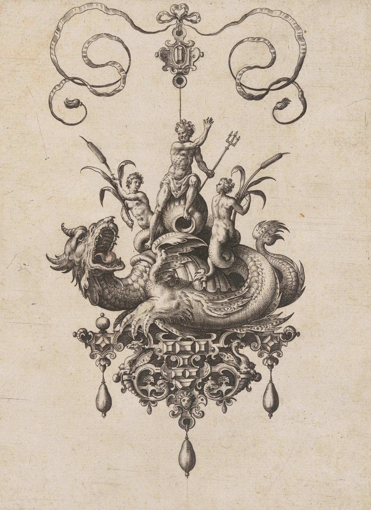

tldr: I wrote a small game kinda by accident. get it [on itch.io]

[on itch.io]: https://hasparus.itch.io/

---

I signed up to run [1 HP Dragon] at a convention in a \<2 hour time window _with
hotseat_. Yeah... Pulling off something good in less than two hours, while your
players can join later or leave in the middle requires effort...

[1 HP dragon]: https://www.explorersdesign.com/the-1-hp-dragon

I need something **accessible**, **fast** and **small**.

I feel like you could play [1 HP Dragon] as a standalone ruleset, with no dice,
just with:

  <Line kind="arrow">If you can do it, do it.</Line>
  <Line kind="arrow">
    {"If you can't do it, plan better or do something else."}
  </Line>

<aside className="min-[1100px]:-translate-y-19">
  Clayton is turning 1 HP Dragon into a full game, but he's [calling
  it](https://www.explorersdesign.com/designing-lore-blocks/) "a game you can't
  play yet", and 1) I have a deadline, 2) I need something __accessible__, a
  basic dice game so everyone can pick it up in 5 seconds.
</aside>

Many players come to the hobby because they like the dice and how randomness and
game mechanics help us tell stories more interesting than we'd be able to tell
without them.

So, some dice resolution will be more accessible than no dice. Principle of
Least Surprise, huh?

{/* prettier-ignore */}
I'm definitely taking a PbtA standard 2d6. Player-facing symmetric dice rolls
are fast: no turns, no action economy, DM doesn't roll. I know it sounds stupid,
but assume all dice rolls take constant time to roll, read the result and
narrate. This makes us more than <Tooltip text="I didn't measure anything. Sorry.">twice</Tooltip>
as fast as D&D!

<aside>DM = Dragon Minder, obviously</aside>

If it's PbtA, I'm gonna need some moves. I'm not taking Homebrew World or One
Shot World, both really good games that served me well on events, because I
won't have much time for character creation and building the world based on the
playbooks.

## Mechanics

We'll play with tiny playbooks. You make up your own Class: "Bard", "Wyvern
Lancer", whatever. It creates fictional positioning, affecting what you can and
cannot do, and once per session it lets you **Bellow**.

<Move illuminated isBaseMove>

### Bellow

Once per session, _when you introduce a fact or narrative detail from your past
life_, it affects the fiction immediately, no roll required. It must be related
to your Class, not the Dragon. The DM and other players can ask you to adapt it.

</Move>

<aside>I considered naming it "Class Action".</aside>

Akin to Blades flashbacks or declaring a fact for FATE point, this lets the
Hunters fire a powerful "ultimate" to bite into the Dragon's Armor, and lets us
get to know the Hunters at the same time.

> A Bard: "I sang for the duke and then we partied way too much. The guy loves
> me. He'll help us for sure."

### Goals

I wanna focus on the player characters' connection to their dragon. We call them
Hunters and each of them has a Goal: Vengeance, Power, Greed, Glory, Knowledge,
Oath.

A Goal can be relinquished, of course. Character development, hell yeah!

<Move illuminated isBaseMove>

### Relinquish Your Goal

When you _give up on your original motivation_,

- describe why you forsake your goal,
- you are visibly changed: it's the way you walk, your facial expression, maybe
  discard a symbol of your previous motivation.

You may bump up a dice roll, happening just now, or in the future. From failure
to partial success, from partial success to full success. Maybe you sacrifice
your goal to help your friends, or the newfound clarity helps you in your
actions.

</Move>

But even before you get rid of it, the pursuit of it lets you affect the game.

<Move illuminated isBaseMove>

### Stoke the Fire

When you _chase your Goal with abandon_, reroll a die, but **mark Pyre**.\
When your Goal _leads you into danger or costs you_ something, take **1 XP**.

</Move>

### Pyre

The **Pyre** is your doom track. Think inverse health pool. Fill the fourth box
and you're **consumed**, dead or worse.

<Track name="Pyre" defaultValue={2} max={4} />

The game is about the Dragon, tactical storytelling and problem-solving, sure,
but also about the relation of our heroes to the Dragon and what they are
willing to sacrifice to defeat it.

**Consumed** doesn't mean "out of the game". If dying is boring, maybe you turn
against your friends as corrupted villains or undead servants of the dracolich.
The DM will feel responsible for time management, so we leave the exact timing
and nature of your fall to them. This is usually an "opportunity for a cost"
moment.

That's goals, but we need some baseline dice resolution, stats and a catch-all
move.

I'm taking 3 stats, Body, Wits and Soul. I reserve the right to attack them as a
DM move if it doesn't make sense to bump **Pyre**, or the time management of the
game demands that. From the perspective of the genre, fighting a dragon is
_exhausting_.

> Distribute values from -2 to +2 so that their total equals +1. Ignoring order:
> `(+2, 0, -1); (+1, +1, -1); (+1, 0, 0); (+2, +1, -2)`
>
> **Body:** Physical strength and stamina.\
> **Wits:** Mental acuity and perception.\
> **Soul:** Arcane potency and spiritual force.
>
> 

I'm gonna base a catch-all on Jeremy Strandberg's [Defy Danger, Restated]. In
the small little village called ~~Stonetop~~ CC BY-SA 4.0, sharing is caring.

[Defy Danger, Restated]:
  https://spoutinglore.blogspot.com/2019/05/defy-danger-restated.html

<Move illuminated isBaseMove>

### Face Fury

When the _stakes are dire, danger is imminent, and you act anyway_, roll:

- **+Body** to endure, act fast or with finesse
- **+Wits** to apply expertise, diplomacy, enact a clever plan, or rely on
  senses
- **+Soul** to invoke the arcane, unleash mystical forces, resist esoteric
  energies

**On a 10+**, you pull it off as well as one could hope.\
**On a 7-9**, the DM will present a partial success, a tradeoff, or a
complication.

</Move>

<aside>
  <figure className="zaduma-line-art *:max-w-[414px]! [&_img]:object-left min-[1100px]:[&_img]:max-h-40 xl:[&_img]:max-h-60">
    
    <figcaption>
      A man on horseback stabbing a monster with a lance, from 'The King and His
      Three Sons', José Guadalupe Posada, 1852–1913
    </figcaption>
  </figure>
</aside>

In all moves calling for a roll: **On 6-**, the player marks **1 XP** and the DM
makes a move.

<Move illuminated isBaseMove>

### Jump Into Flames

When you _throw yourself in to help another Hunter after their roll_, they
reroll one die, but you share the consequences. More than one person can jump in
on the same action.

</Move>

<aside>
  If **Jump Into Flames** or **Relinquish Your Goal** change a roll so it's no
  longer a miss, the miss XP and the DM move are cancelled. If it didn't play
  out as a miss in fiction, it was not a miss.
</aside>

<Move illuminated isBaseMove>

### Throw Sand

When you _interfere with another Hunter's action_, [**Face Fury**](#face-fury).\
**On 7+** you impose -2 to their roll or diminish their effect. They may choose
to stop what they're doing and get 1 XP.\
**On 10+** you also avoid the consequences.

</Move>

<Move illuminated isBaseMove>

### Level Up

When you _have **4 XP** or more, and a moment of rest_, spend **4 XP** to raise
one of your stats by **+1** (up to **+3**) or clear **1 Pyre**.

</Move>

<Move illuminated isBaseMove>

### Aftermath

When _the game ends_, go around the table.

Take **1 XP** if you have defeated the Dragon.\
Take **1 XP** if you mention something another Hunter did that you like, which
wasn't mentioned before.

For each unspent **XP** you hold, choose one from the following:

- **Fulfill your Goal.** Describe how getting what you wanted changes your life.
- **Clear 1 Pyre**. Time and distance heal your wounds.
- **Claim a piece of the Dragon** that wasn't destroyed, like the Dragon's
  adamantium scales, its hoard, or its dormant horde of undead.

Choices are repeatable. If you
[**Relinquished your Goal**](#relinquish-your-goal), describe the life you found
in its place.

Then, go around the table once again.

If you're **consumed** and dead, describe the legend told about you. If you're
**consumed**, but alive, describe your grim future. Otherwise, for each marked
**Pyre**, another Hunter describes a shadow over your future.

The DM looks at the remaining pieces of the Dragon and narrates their future.
Maybe, even with the Dragon defeated, the story isn't over? Maybe the Wyrmlings
have fled? Maybe someone has come to the battlefield after the Hunters left.

When it's all over, for the last time, go around the table.

Say one Wish, something that could've been handled better or differently, in
fiction or at the table; and Highlight one thing you liked in the game.

</Move>

<aside>
  The DM should crumple all post-it notes with destroyed Legendary & [Permanent
  Armor][1 HP Dragon] of the Dragon by this moment, so it's easier for players
  to claim the remaining pieces.
</aside>

## DM Moves

I'm leaving the DM moves, agenda and principles as an exercise to the reader.
Tis but a write-up for people who already played a lot of games. I'm playing
this with a list yoinked from Stonetop, because I have it engraved in my brain.
_"Reveal an unwelcome truth"_ creates a new situational armor or tells us
something about existing legendary armor. "Hurt someone" allows me to hurt them
narratively and also mark _**Pyre**_.

<aside>
  If you've read this far without reading [1 HP Dragon], "Armor" is an obstacle,
  a puzzle to solve narratively to defeat the boss.
</aside>

You can use any other list that kinda fits, like
[the one in MotW](https://evilhat.com/wp-content/uploads/2022/01/Monster-of-the-Week-Revised-Keeper-Reference-Sheets.pdf)
or Apocalypse World. Barf forth apocalyptica, if you so please.

the Dragon is by definition big and scary, so feel free to use multiple hard
moves at once. _Separate_ and _hurt them_. Break their stuff and soar into the
sky. Or, inspired by MotW: _Boast and gloat, revealing a secret_ and then
_Escape_.

<aside>
  <q>
    <strong className="inline-block translate-x-[1.5px]">DM:</strong> the Dragon
    speaks in your dead brother's voice. It calls you by the childhood name
    nobody knows. Take -1 Soul. You got lost in the mist, you can't hear your
    companions.  
    What do you do?
  </q>
</aside>

## Narrative Structure

Running this at [Bazyliszek](https://bazyliszek.ava.waw.pl/), I'm basically
planning to do a few rounds around the table.

0. I tell the players that _roleplaying is a conversation with mechanics
   sprinkled on_ and that I won't kick them under the table if they interrupt
   me.
1. Players create and introduce the characters. I ask questions to learn about
   them and the Dragon.
2. I write down its Legendary Armor, Permanent Armor and Lore on post-it notes
   and put them in the middle of the table.
3. We play as usual, solving the Dragon, narrating the actions. I run the core
   game loop and ask "what do you do" a hundred times.
4. We run the [**Aftermath**](#aftermath), the Hunters make their choices, and
   we narrate what comes next. Did the Knight marry the Princess? Is the Wizard
   who gave up on his quest for forbidden Knowledge now teaching kids at a
   school?

Thanks to my dear friend
[Zack Thomson](https://bsky.app/profile/zackthomson.bsky.social) for talking it
out with me on Discord and helping me come up with something semi-decent.

---

<footer>

## Prior Art & Attributions

This is a "DLC" to [1 HP Dragon] by Clayton Notestine; _Face Fury_ adapts Jeremy
Strandberg's [Defy Danger, Restated], used under [CC BY-SA 4.0]; and I run the
game with the DM moves from his [Stonetop] **or** [Monster of the Week] Keeper
moves by Mike Sands. The ruleset in this post is shared under [CC BY-SA 4.0].
All the images in this article are public domain.

[Stonetop]: https://www.lampblackandbrimstone.com/
[Monster of the Week]: https://evilhat.com/product/monster-of-the-week/
[CC BY-SA 4.0]: https://creativecommons.org/licenses/by-sa/4.0/

</footer>

<figure className='*:first:dark:opacity-80 mt-10'>

<figcaption>
  a ca. 1581 jewelry design by Hans Collaert I depicting Neptune riding a
  sea-monster
</figcaption>

</figure>
